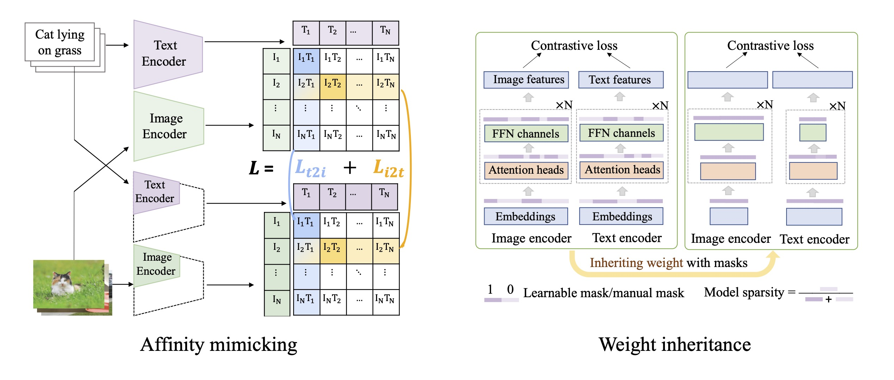
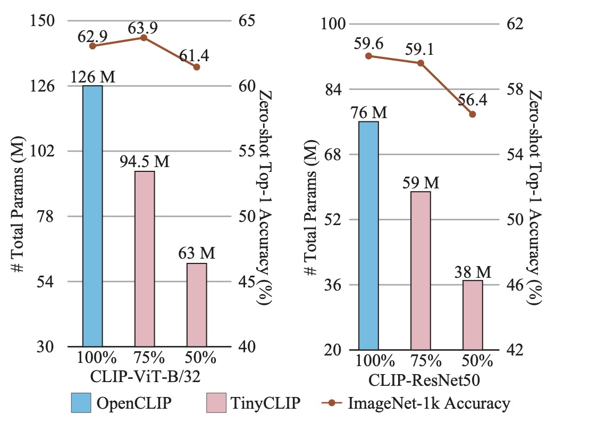

# TinyCLIP Model Zoo

Thanks for your attention to our work : )

It is the model zoo about the ICCV 2023 paper: TinyCLIP: CLIP Distillation via Affinity Mimicking and Weight Inheritance

We release **the code** in the project [microsoft/Cream](https://github.com/microsoft/Cream/tree/main/TinyCLIP)

**TinyCLIP** is a novel **cross-modal distillation** method for large-scale language-image pre-trained models. The method introduces two core techniques: **affinity mimicking** and **weight inheritance**. This work unleashes the capacity of small CLIP models, fully leveraging large-scale models as well as pre-training data and striking the best trade-off between speed and accuracy.

  

## Highlights

  

* TinyCLIP ViT-45M/32 uses only **half parameters** of ViT-B/32 to achieves **comparable zero-shot performance**.
* TinyCLIP ResNet-19M reduces the parameters by **50\%** while getting **$2\times$** inference speedup, and obtains **56.4\%** accuracy on ImageNet.
